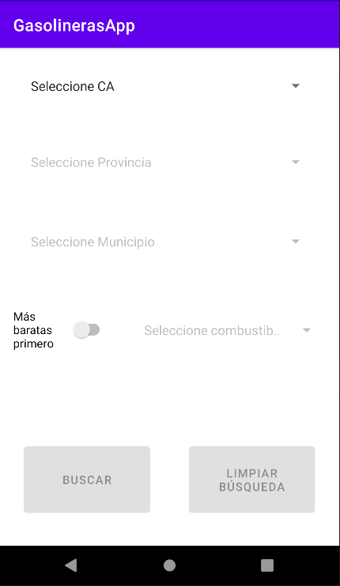
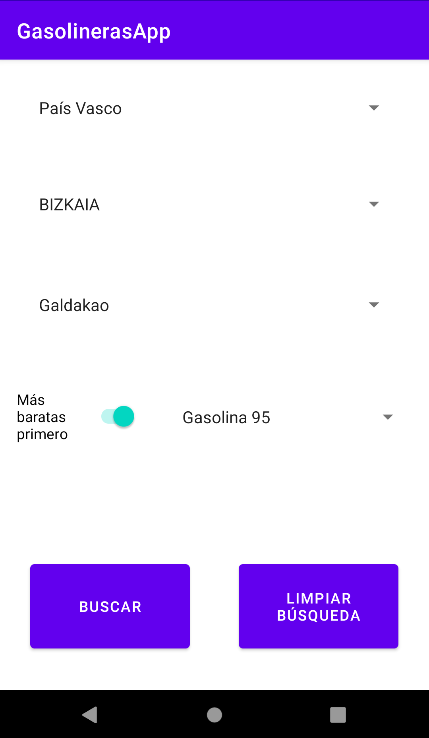
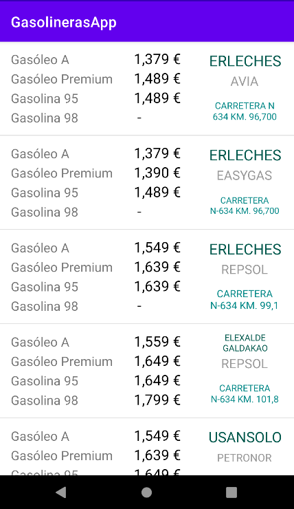

# GasolinerasApp

## Introducción
---

El objetivo de esta aplicación es proporcionar información actualizada sobre gasolineras y precios de combustible. Esta información se obtiene directamente de la API pública expuesta por el Ministerio de Asuntos Económicos y Transformación Digital del Gobierno de España.

## Funcionalidades
---

- Búsqueda de gasolineras por CA, provincia y municipio
- Filtro por precio más económico según combustible elegido
- Soporte para idiomas:
  - Euskara
  - Español
- En la lista de gasolineras, tras realizar pulsación prolongada sobre una de las gasolineras se redirige a Google Maps con la dirección de la estación
- Al iniciar la aplicación, ésta recuerda los valores usados en la última búsqueda (CA, provincia, municipio y filtro por precio más económico)

## Cómo se ha desarrollado la aplicación
---

- La aplicación está desarrollada para dispositivos Android empleando Java como lenguaje principal. Se usan librerías como Volley o GSon.
- Se ha empleado Android Studio para su desarrollo
- La interfaz de usuario es extremadamente simple y, por tanto, con mucho márgen de mejora.

## De dónde se obtienen los datos
---

Toda la información que se muestra en pantalla es la obtenida directamente de la API arriba mencionada. A continuación se muestra el enlace con los endpoints y la ayuda:
- https://datos.gob.es/es/catalogo/e05068001-precio-de-carburantes-en-las-gasolineras-espanolas
- https://sedeaplicaciones.minetur.gob.es/ServiciosRestCarburantes/PreciosCarburantes/help

## Trabajo futuro
---
- Aplicación para iOS
- Mejora de interfaz
- Generación de APK y primera release

## Cómo colaborar

Cualquier colaboración, contribución o sugerencia es muy bien recibida. Para sugerencias de futuras implementaciones o bugs encontrados, abre un issue con la mayor información posible.

Para contribuir con el proyecto, haz un fork del mismo y crea un PR. Lo revisaré a la mayor brevedad.

## Quién soy yo
---
Mi nombre es Igor Recio y aunque trabajo como ingeniero de calidad del software, me gusta desarrollar y descubrir nuevas tecnologías. Esta aplicación es parte de esos descubrimientos y por ello, imperfecta. Te invito a que participes de este proyecto abierto a todas las personas interesadas.

## Final disclaimer
---
- Revisa la licencia empleada
- __Recuerda que esto es un proyecto de alguien que no es desarrollador profesional, habrá "cosas" en el código (muy, pero que muy) mejorables. Siéntete libre de abrir un PR o un issue para comentarlas. Con ello mejoras el proyecto y enseñas al resto buenas prácticas de desarrollo.__

## Capturas

